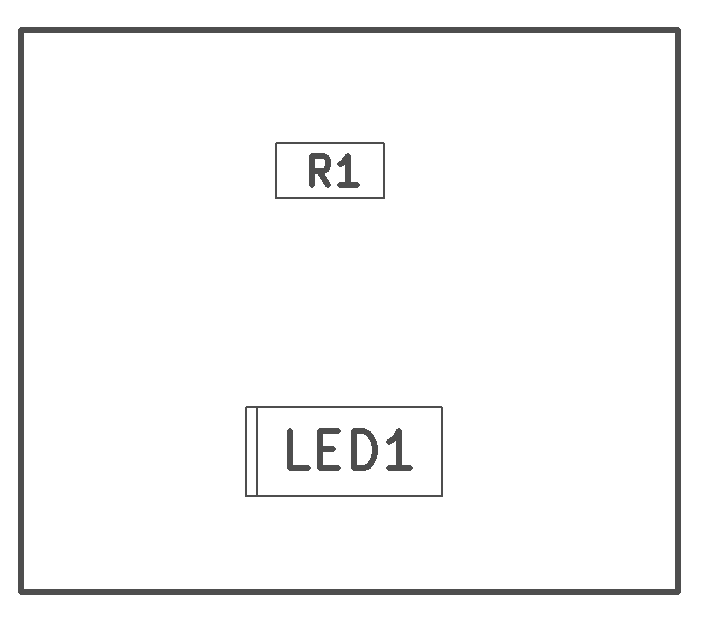
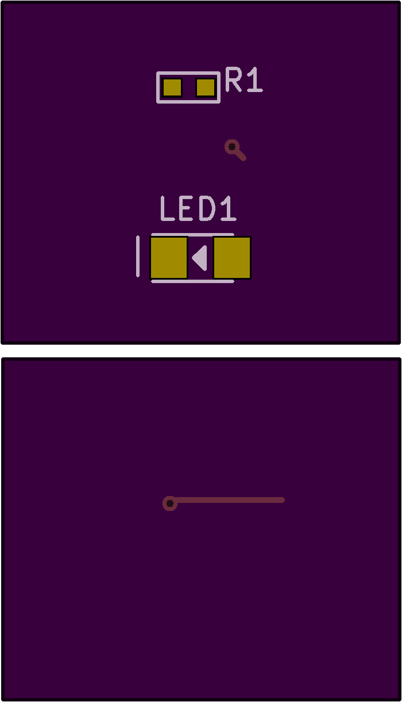

<!--- start title --->
# Test Board v1.0
test board

- Updated: 15 May 2018

- Author: Jenner Hanni
- Website: http://wickerbox.net
- Company: Wickerbox Electronics
- License: CERN Open Hardware License v1.2
<!--- end title --->

Description.

<!--- bom start --->
### Bill of Materials

|Ref|Qty|Description|Digikey PN|
|---|---|-----------|------|
|LED1|1|LED BLUE CLEAR SMT 1206|732-4989-1-ND|
|R1|1|RES SMD 470 OHM 5% 1/4W 0603|RHM470DCT-ND|

<!--- bom end --->
<!--- assy start --->
### Assembly Info for Quoting

<!--- assy end --->

